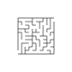

# tree_labyrinth




Minimal spanning trees are used to create randomized labyrinths.

Outpupt:
- Default is SVG
- To create *gnuplot* script output use the `edges_to_gp` function.
    Gnuplot output is optimized for square format.

Programm uses two integer parameters for the dimensions,
see here to create a 26 by 26 squares labyrinth.

```
./labyrinth square 26 26
```
You can also make it round:
```
./labyrinth circle 26 26
```

## Installation

Do this:

```
git clone git@github.com:niccokunzmann/tree_labyrinth.git
cd tree_labyrinth/
g++ -std=c++14 -o labyrinth labyrinth.cpp
```

You will need to have `g++` installed.

## Related Work

Based on this algorithm, we created a [3d labyrinth on top of the
3d terrain of Potsdam][potsdam-3d].


[potsdam-3d]: https://www.tinkercad.com/things/kBF1QwTNsM5-labyrinth-13x13-potsdam-height-profile

